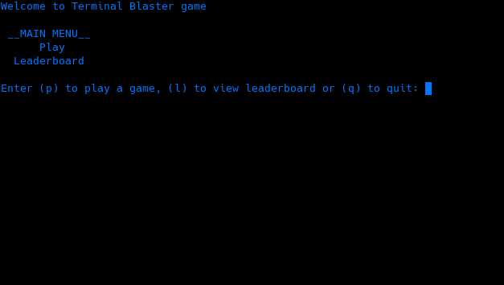

# Terminal Blaster 
> A text based version of classic minesweeper

The goal of Minesweeper is to "complete" the board without detonating any of mines.

## Getting started

Install with pip:
* `$ pip install saper2.py`
* `$ saper2.py`

## Usage

> Once you setup game you are free to run it

### How to play

* Game is made with easy to follow commands, choose action and hit enter

<kbd>  </kbd>

 

* Playing

* If you make a typo, [pyspellchecker](https://pyspellchecker.readthedocs.io/en/latest/#) module will correct you (only for game modes)

