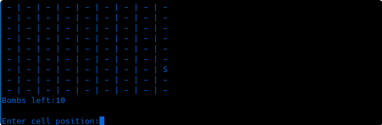
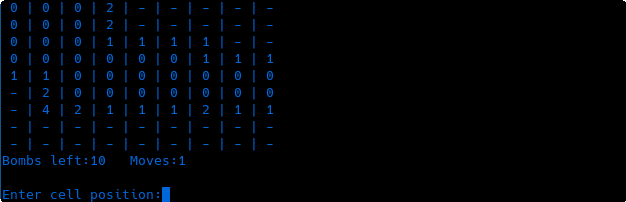

# Terminal Blaster 
> A text based version of classic minesweeper

Project created while learning the python programming language

## Tech used

Python 3.6+ with external packages:
*  [pyspellchecker](https://pyspellchecker.readthedocs.io/en/latest/#)
* [pandas](https://pandas.pydata.org/)

## Table of contents

- [Features](#features)
- [Description of files](#description-of-files)
- [Getting started](#getting-started)
    - [Setup](#setup)
    - [Installation](#installation)
- [Usage](#usage)
    - [How to navigate](#how-to-navigate)
    - [How to play](#how-to-play)
    - [Other](#other)
- [Credits](#credits)
- [License](#license)


## Features

* Minimum moves to complete the board
* Moves efficiency
* Leaderboard update; remove scores

## Description of files

| Filename | Description |
|---|---|
| saper2.py | Python file, here is a game |
| README.md | Markdown-formatted text file with a project description |
| my_words.json | Dictionary words are stored in json data file |
| sb.csv | The csv file contains the scoreboard data |
| media | In this folder can be found GIF's and images |
| requirements.txt | Requirements to run the code |
| LICENSE | License |

## Getting started

> To run the game you need to have Python 3 installed along with the required libraries

### Setup

Clone the repository to your local machine or download the python file. Ensure that Pip, the Python package installer, is installed. You can verify this by running:

* Unix/macOS: `python3 -m pip --version`
* Windows: `py -m pip --version`

If pip is not installed visit this [website](https://pip.pypa.io/en/stable/installation/#get-pip-py)


### Installation

> It is highly recommended to use a [virtual environment](https://docs.python.org/3/library/venv.html) when running it

Open the folder contatining the python file in the terminal and type the following command to make sure you have installed the libraries needed to run the application:

* Unix/macOS/Windows: `pip3 install -r requirements.txt`

When you complete this step, you are prepared to run it:
* Unix/macOS/Windows: `python3 saper2.py`


## Usage

> Here are a few tips to help you get through it

### How to navigate

* The menu is designed with simple instructions; **select an action** and press **Enter**
<p align="center">

</p> 

### How to play

* Enter a cell's coordinates to make it visible **X Y** (width, height)
<p align="center">

<br>
<em>[noguess mode] Level easy: grid size 9x9 (8 6 are the coords of S)</em>
</p>

* Put a **F** at the end of the coordinates to flag a cell **X Y F**
<p align="center">

<br>
<em>Simply repeat the command to unflag a cell </em>
</p>

* If you succeed, enter your name to **keep your score**
<p align="center">

<br>
<em>From the main menu, you may access the leaderboard </em>
</p>

### Other

* The scoreboard has a sorting feature
<p align="center">

<br>
<em>Scoreboard only supports standard and noguess modes and always displays the top 10 results </em>
</p>

* A misspelling will be corrected by the [pyspellchecker](https://pyspellchecker.readthedocs.io/en/latest/#) module
<p align="center">

<br>
<em>Works only for a game modes </em>
</p>

* You can alter the board size and mines number in the saper2.py file (**not advised**), or you can just switch to god mode. Open **saper2.py** in your code editor use shortcut `ctrl + f` and search for **def run_game():**

```python
def run_game():
    easy = Board(9, 9, 10, 1200)
    medium = Board(16, 16, 40, 1200)
    advance = Board(16, 30, 100, 1200)
```
easy = Board(**height, width, bombs, timeout**)

## Credits

@thaiboyspeedrun - Without you, it would never have happend<3

<a href="https://www.flaticon.com/free-icons/bomb" title="bomb icons">Bomb icons created by Freepik - Flaticon</a>

## License
[MIT](https://choosealicense.com/licenses/mit/) © rvqy


